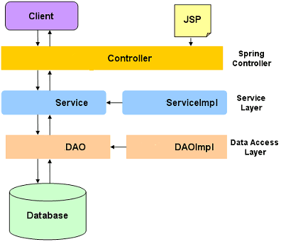

This is a complete end-to-end application using Spring 3.0 MVC
as front end technology and Hibernate as backend ORM technology.

For this application we are also using Maven for build and dependency
management and MySQL as database to persist the data.

Application Architecture
------------------------
We will have a layered architecture for our web application.
The database will be accessed by a Data Access layer popularly
called as DAO Layer.

This layer will use Hibernate API to interact with database.
The DAO layer will be invoked by a service layer.

Project Architecture
--------------------

